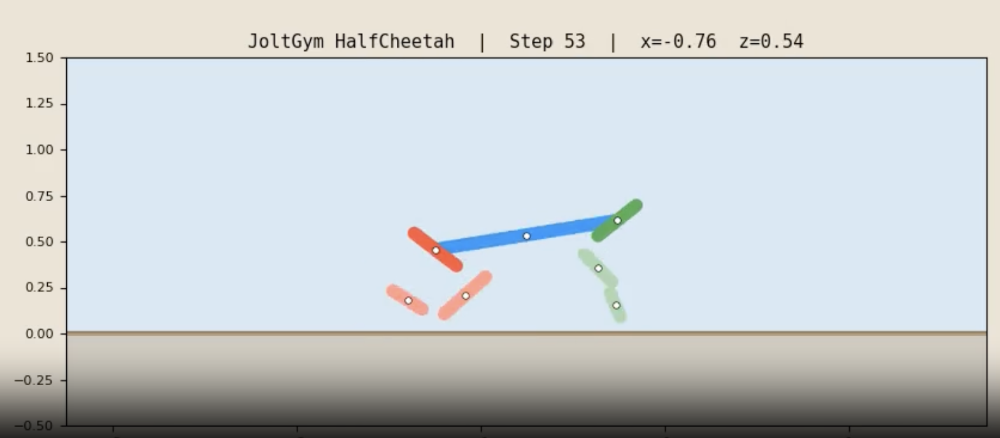
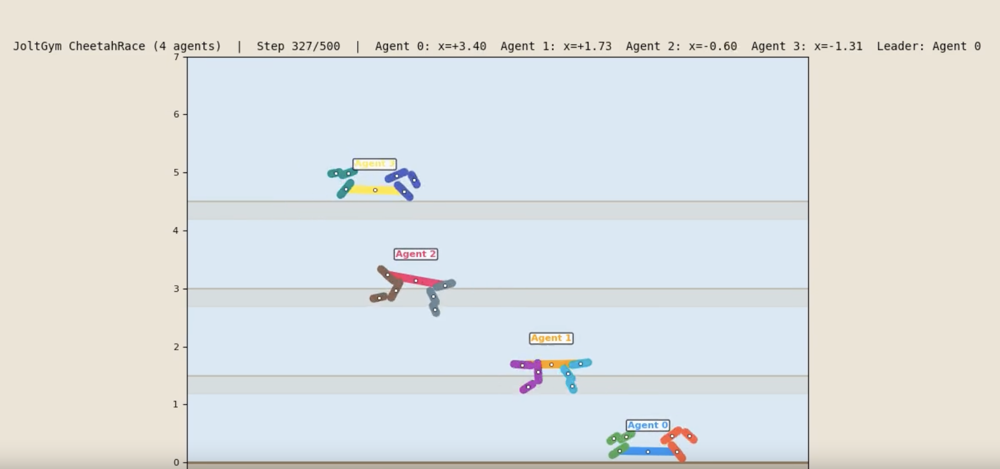

# JoltGym

A MuJoCo-compatible physics simulation engine for reinforcement learning, built on [Jolt Physics](https://github.com/jrouwe/JoltPhysics) with Vulkan rendering and Python (Gymnasium) bindings.

This is work in progress, and might not be fully usable right now. Contributions or ideas are appreciated if the project is of interest!

## Features

- **Jolt Physics backend** — C++17, deterministic (cross-platform), excellent multicore scaling
- **MJCF compatibility** — loads MuJoCo XML models (HalfCheetah, Humanoid)
- **Gymnasium API** — drop-in `env.reset()` / `env.step()` / `env.render()` interface
- **Vulkan renderer** — SDL2 window + Dear ImGui debug overlay (macOS via MoltenVK, Linux, Windows)
- **Offscreen rendering** — headless `rgb_array` mode for training servers
- **WorldPool** — N parallel `PhysicsSystem` instances stepped from C++, ~73K env-steps/sec
- **Multi-agent** — multiple robots in a single shared world with collision
- **Zero-copy Python** — pybind11 + NumPy, hot path entirely in C++





## Architecture

```
Python (Gymnasium API)
  └── pybind11 bindings (zero-copy NumPy)
       └── C++ Core
            ├── MJCF Parser (tinyxml2)
            ├── Physics (Jolt Physics)
            ├── Renderer (Vulkan + SDL2 + ImGui)
            └── WorldPool (N parallel PhysicsSystem instances)
```

## Environments

### HalfCheetah-v0

2D planar cheetah locomotion (6 actuated joints, slide+hinge root).

| Property | Value |
|---|---|
| Observation | `Box(-inf, inf, (17,))` — qpos[1:] + qvel |
| Action | `Box(-1, 1, (6,))` — normalized joint torques |
| Reward | `forward_velocity - 0.1 * ctrl_cost` |
| Timestep | 0.01s, frame_skip=5 |

```python
import joltgym
env = joltgym.make("JoltGym/HalfCheetah-v0")
```

### Humanoid-v0

3D humanoid locomotion (17 actuated joints, free 6DOF root).

| Property | Value |
|---|---|
| Observation | `Box(-inf, inf, (45,))` — qpos[2:] + qvel |
| Action | `Box(-0.4, 0.4, (17,))` — normalized joint torques |
| Reward | `1.25 * forward_vel + 5.0 * healthy - 0.1 * ctrl_cost` |
| Termination | root z outside [1.0, 2.0] |
| Timestep | 0.003s, frame_skip=5 |

Observation breakdown:

| Indices | Dim | Content |
|---|---|---|
| 0 | 1 | root z position (height) |
| 1-4 | 4 | root quaternion (w,x,y,z) |
| 5-21 | 17 | joint angles |
| 22-24 | 3 | root linear velocity (x,y,z) |
| 25-27 | 3 | root angular velocity (x,y,z) |
| 28-44 | 17 | joint velocities |

```python
import joltgym
env = joltgym.make("JoltGym/Humanoid-v0")
```

**MJCF features used:** free joint (6DOF root), multi-joint bodies (hip=3 hinges, waist=2, shoulders=2), arbitrary joint axes, sphere geoms, quaternion body poses, intermediate body decomposition for compound joints.

### CheetahRace-v0

Multi-agent race: N cheetahs in a shared physics world.

| Property | Value |
|---|---|
| Observation | `Box(-inf, inf, (N*17,))` — flat concatenation |
| Action | `Box(-1, 1, (N*6,))` — flat concatenation |
| Reward | sum of per-agent forward rewards |

```python
import joltgym
env = joltgym.make("JoltGym/CheetahRace-v0", num_agents=4)
```

## Performance

Benchmarked on the same machine (HalfCheetah, Apple Silicon):

| Envs | JoltGym (C++ WorldPool) | MuJoCo (AsyncVectorEnv) |
|---|---|---|
| 1 | 11,935 sps | 17,477 sps |
| 8 | 33,292 sps | 11,024 sps |
| 64 | 64,503 sps | 18,608 sps |
| 256 | 73,606 sps | 18,287 sps |

MuJoCo is faster single-threaded. JoltGym scales to **3.8x faster at 64+ envs** via C++ parallel stepping with per-world `JobSystemSingleThreaded`, avoiding Python subprocess overhead entirely.

## Requirements

- CMake 3.20+
- C++17 compiler (Clang, GCC, MSVC)
- Python 3.9+ with NumPy and Gymnasium
- Vulkan SDK (for renderer; optional)

All C++ dependencies are fetched automatically via CMake FetchContent:
Jolt Physics, tinyxml2, SDL2, Dear ImGui, vk-bootstrap, VMA.

## Build

### Python package (recommended)

```bash
pip install -e .
```

This uses scikit-build-core to build the C++ code and install the Python package.

### CMake (C++ development)

```bash
# Full build (with renderer)
cmake -B build -DCMAKE_BUILD_TYPE=Release
cmake --build build -j$(nproc)

# Without Vulkan renderer
cmake -B build -DCMAKE_BUILD_TYPE=Release -DJOLTGYM_BUILD_RENDERER=OFF
cmake --build build -j$(nproc)
```

### CMake options

| Option | Default | Description |
|---|---|---|
| `JOLTGYM_BUILD_RENDERER` | `ON` | Build Vulkan renderer (requires Vulkan SDK) |
| `JOLTGYM_BUILD_PYTHON` | `ON` | Build pybind11 Python module |
| `JOLTGYM_BUILD_TESTS` | `OFF` | Build C++ test executables |

## Usage

```python
import joltgym

env = joltgym.make("JoltGym/HalfCheetah-v0")
obs, info = env.reset(seed=42)

for _ in range(1000):
    action = env.action_space.sample()
    obs, reward, terminated, truncated, info = env.step(action)
    if terminated or truncated:
        obs, info = env.reset()

env.close()
```

### Training with Stable-Baselines3

```bash
# HalfCheetah
python examples/train_ppo.py --timesteps 1000000

# Humanoid
python examples/train_humanoid.py --timesteps 2000000

# Multi-agent race
python examples/train_multiagent.py --agents 4 --timesteps 1000000
```

### Visualization

```bash
# Training curves (TensorBoard)
tensorboard --logdir logs/

# Record videos
python examples/record_video.py --model models/halfcheetah_ppo
python examples/record_race.py --model models/cheetah_race_ppo --agents 4
```

## Technical Details

### Motor Model

Actuators use Jolt's position motor with spring settings (`StiffnessAndDamping` mode). This maps MuJoCo's joint force equation:

```
tau = gear * action - stiffness * pos - damping * vel
```

into Jolt's implicit spring integrator by setting `target = gear * action / stiffness`, giving stable physics even at high gear ratios.

### Multi-Joint Body Decomposition

Bodies with multiple hinge joints (e.g. humanoid hip with 3 DOFs) are decomposed into a chain of intermediate bodies connected by single hinge constraints:

```
parent → hinge₁ → intermediate₁ → hinge₂ → intermediate₂ → hinge₃ → actual_body
```

Intermediate bodies are tiny-mass spheres (0.001 kg) that act purely as kinematic connectors.

### WorldPool Parallelism

Each environment uses `JobSystemSingleThreaded` (no internal Jolt threading). A C++ `ParallelFor` distributes environments across `min(hardware_concurrency, 16)` OS threads. This avoids the deadlock/contention of sharing Jolt's thread pool across worlds and eliminates Python subprocess overhead.

## License

MIT
